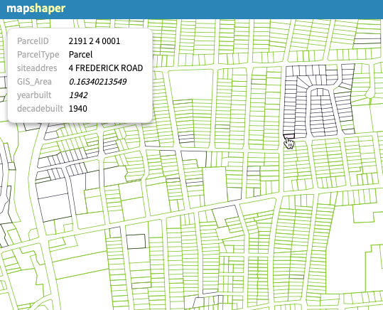

# otl-year-built
Leaflet map of parcels by decade built to display history of property development in West Hartford CT and Hamden CT, for https://OnTheLine.trincoll.edu

## West Hartford map
https://ontheline.github.io/otl-year-built/index-caption.html

## Hamden map
https://ontheline.github.io/otl-year-built/hamden/index-caption.html

## Credits
Interactive map developed by Jack Dougherty and Ilya Ilyankou / Picturedigits for On The Line, http://OnTheLine.trincoll.edu, Trinity College, Hartford CT

## West Hartford Data and Notes
Shapefiles with parcel identifiers and year-built data provided by Town of West Hartford and AppGeo in June 2021 from the Online Assessment Database https://gis.vgsi.com/westhartfordct/. Thanks to Jared Morin (jared.morin@westhartfordct.gov) and Rebecca Talamini (spatialiqsupport@appgeo.com).

Note that "yearbuilt" means "most recent year of construction recorded for this parcel" because this present-day assessment database was not designed to be a complete historical record of all property development. For example, it does not record when a building was first erected on a property (e.g. 1910), then torn down  (e.g. 1970), because only the most recent date of construction is stored (e.g. 1970). Also, "yearbuilt" data missing for about 600 out of nearly 20,000 parcels (3%), which are included in a separate file `no-year-built.geojson` but not displayed in the interactive map. Only properties that currently exist are shown in this present-day assessment database.

Based on "yearbuilt", we added a new field named "decadebuilt" where "1900s" means 1900-1909, "1910s" means 1910-1919, etc. "Pre1900" means all years before 1900.

GIS_Area is measured in acres (eg. 4 Frederick Road = 0.16 acres)

## West Hartford Data Cleaning and GeoJSON Conversion
Shapefiles processed by Jack Dougherty in https://Mapshaper.org to clean duplicates (condos and other units on same parcel with same or similar street address), create `decadebuilt` column, and to convert to GeoJSON files.

- Uploaded shapefiles.zip to Mapshaper.org
- ignore 23 line intersections
- console: -proj wgs84
- console: -split ParcelType, which divided into different files by type:
  - 20,042 Parcel
  - 2,387 Condo Main
  - 22 unnamed
  - 1 Water (ignore)
  - 1 Private ROW (ignore)
  - 1 Paper Street (ignore)
- Export into separate geojson files
- Also, export Condo Main into CSV and create pivot table by ParcelID and yearbuilt. Note that 56 features have multiple entries (units on same lot) but same ParcelID and same GIS_Area (where each condo is listed as the entire property lot, so needed to eliminate duplicates)
- Upload only the Condo predissolved geojson file, where multiple condos have same ParcelID (but slightly different addresses), and use console to dissolve but "copy" (aka keep) first instance of selected fields into the dissolved feature.
  - console: $ dissolve ParcelID copy-fields=ParcelID,ParcelType,siteaddres,GIS_Area,yearbuilt
  - [dissolve] Dissolved 2,387 features into 56 features
- Manually assign decadebuilt field to Condo CSV, and join to Condo GeoJSON
- Upload only Parcels predissolved geojson, where a few hundred multiple units have same ParcelID (similar to condos), and dissolve but keep first instance as above.
  - $ dissolve ParcelID copy-fields=ParcelID,ParcelType,siteaddres,GIS_Area,yearbuilt
  - [dissolve] Dissolved 20,042 features into 19,865 features
- Upload only unnamed GeoJSON, export CSV, and join in decadebuilt field. About 20 rows are empty and must be ignored.
- -merge-layers target=WH-Parcel-decadebuilt,WH-Condo-decadebuilt,WH-unnamed-decadebuilt
- simplified 100MB fullsize GeoJSON down 50% (large, 50MB) in order to upload to GitHub, and simplified at 0.5% (simplified, 11MB) 11MB, which you think would be even smaller, but it's not
- -split decadebuilt (to produce one GeoJSON file for each decade/century)
- downloaded WH-yearbuilt.csv and created pivot table to show results

## West Hartford Results

| Decade-Century Built | Count | Percent |
|----------------------|-------|---------|
| 1700                 | 25    | 0%      |
| 1800                 | 25    | 0%      |
| 1850                 | 162   | 1%      |
| 1900                 | 205   | 1%      |
| 1910                 | 784   | 4%      |
| 1920                 | 3019  | 15%     |
| 1930                 | 2183  | 11%     |
| 1940                 | 3020  | 15%     |
| 1950                 | 6199  | 31%     |
| 1960                 | 2181  | 11%     |
| 1970                 | 742   | 4%      |
| 1980                 | 306   | 2%      |
| 1990                 | 179   | 1%      |
| 2000                 | 206   | 1%      |
| 2010                 | 90    | 0%      |
| 2020                 | 7     | 0%      |
| na                   | 594   | 3%      |
| Total                | 19927 | 100%    |

| Decade-Century Built | Acres | Percent |
|----------------------|-------|---------|
| 1700                 | 24    | 0%      |
| 1800                 | 117   | 1%      |
| 1850                 | 78    | 1%      |
| 1900                 | 111   | 1%      |
| 1910                 | 248   | 2%      |
| 1920                 | 797   | 6%      |
| 1930                 | 810   | 6%      |
| 1940                 | 940   | 8%      |
| 1950                 | 2949  | 24%     |
| 1960                 | 3123  | 25%     |
| 1970                 | 560   | 4%      |
| 1980                 | 309   | 2%      |
| 1990                 | 172   | 1%      |
| 2000                 | 407   | 3%      |
| 2010                 | 145   | 1%      |
| 2020                 | 3     | 0%      |
| na                   | 1721  | 14%     |
| Total                | 12517 | 100%    |

Acres based on sum of GIS_Area

## Hamden data and cleaning
- Data provided by Andrew Kinlock, Town of Hamden GIS coordinator, Feb 2024
- created decadebuilt column in Excel
- removed about 20 rows from SRCOG_LU
  - Open Space
  - Other (golf course, cemetery, etc)
- confirmed UniqueID for each parcel, no duplicates, so simpler than WH data
- upload original hamden-parcels.geojson to Mapshaper.org, ignore Check Line Intersections, but BEFORE IMPORT in the box declare string-fields=id (to convert numerical id to string id to match column type inside geojson)
- join data keys=id,id
  - [join] Joined data from 15,605 source records to 15,605 target records
  - [join] 1149 target records received no data
- exported copy of hamden-parcels-largejoin.geojson as backup, then simplified 13MB file down to 21 percent, now 9MB (you think it would be smaller, but no)
- split decadebuilt (to produce one GeoJSON file for each decade) and exported separate geojson files, except the "null" file with no decadebuilt data. Largest file was 1950s at 1.9MB
- note how named Hamden decadebuilt and filenames differently (plural pre1900s) than WestHartford (singular pre1900)

## Hamden results 

Hamden Parcels (where yearbuilt does not equal zero)
| DecadeBuilt | Grand Total | Residential | Pct Res Tot |
|-------------|-------------|-------------|-------------|
| pre1900s    | 259         | 224         | 2%          |
| 1900s       | 216         | 177         | 1%          |
| 1910s       | 288         | 266         | 2%          |
| 1920s       | 2215        | 2090        | 14%         |
| 1930s       | 1468        | 1403        | 10%         |
| 1940s       | 2369        | 2297        | 16%         |
| 1950s       | 3662        | 3522        | 24%         |
| 1960s       | 1856        | 1739        | 12%         |
| 1970s       | 1034        | 957         | 6%          |
| 1980s       | 1068        | 997         | 7%          |
| 1990s       | 670         | 624         | 4%          |
| 2000s       | 457         | 406         | 3%          |
| 2010s       | 64          | 39          | 0%          |
| Grand Total | 15626       | 14741       | 100%        |
